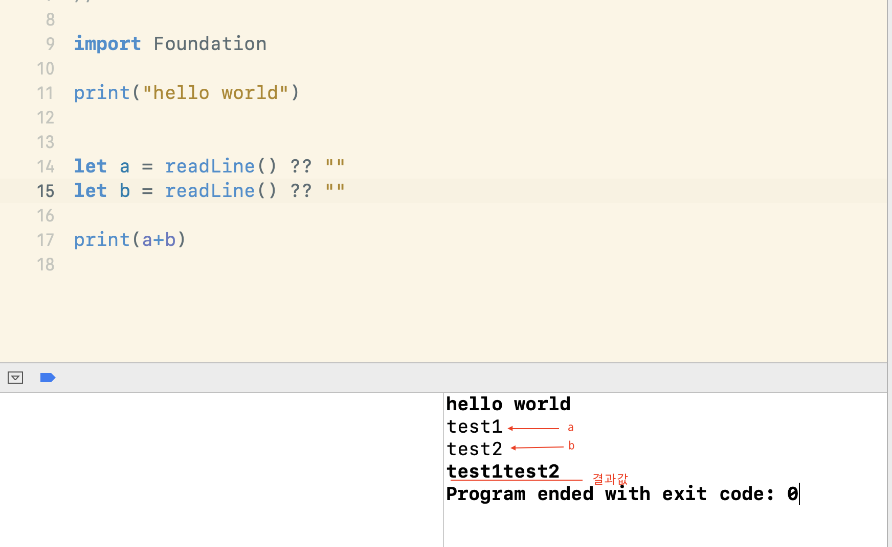
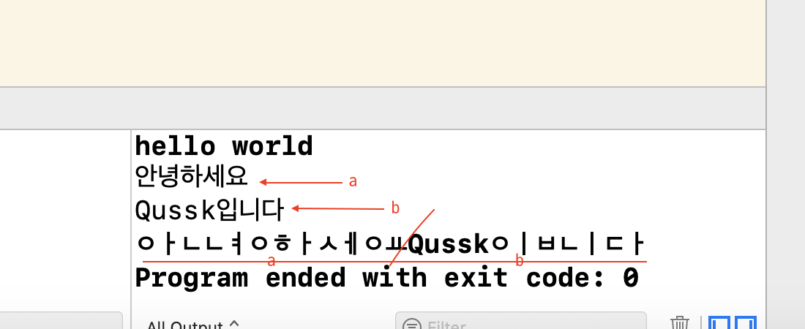
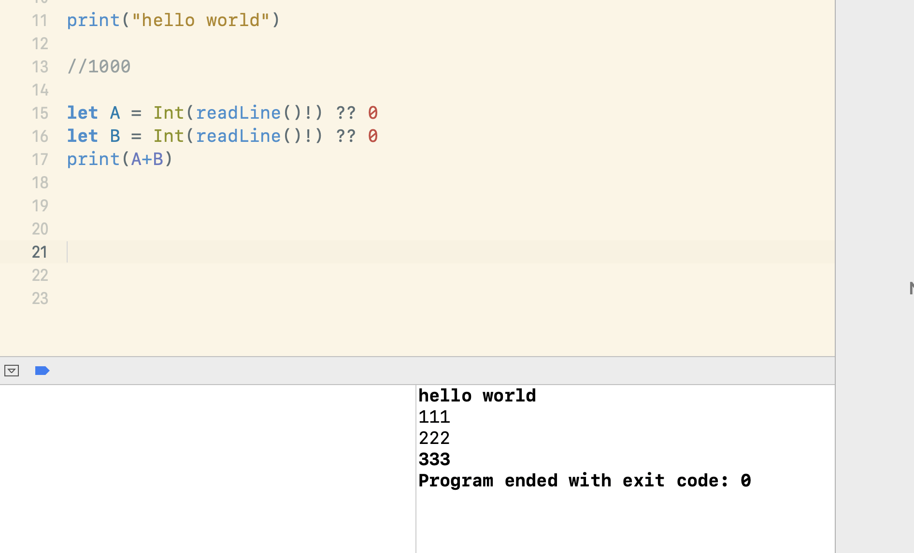
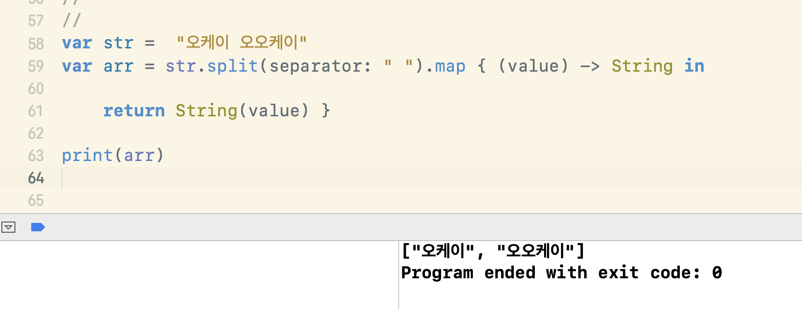
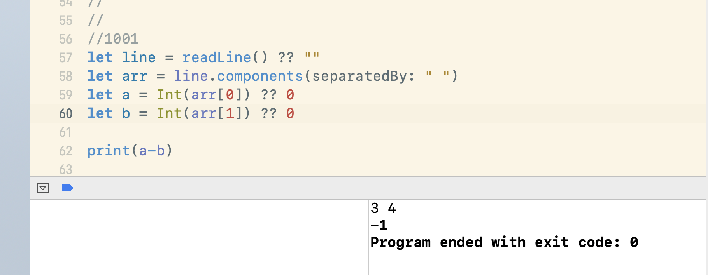

## 백준 알고리즘
[https://www.acmicpc.net/](https://www.acmicpc.net/)


### **전체문제**
- [1000: A+B](#1000)
- [1001: A-B](#1001)
- [1008: A/B](#1008)
-
-
- [10171: 고양이 만들기](#10171)
- [10172: 개](#10172)
- [10998: A*B](#10998)
- [11718: 그대로 출력하기](#11718)
- [11719: 그대로 출력하기2](#11719)
- [10869: 사칙연산](#10869)

### **알고리즘 분류**
- 


### **필요한 개념**
- [readLine](#readLine)
- [split](#split)
- [components](#components)
- [while](#while)
***
### **[전체문제]**

### 1000
```swift
//1000

let A = Int(readLine()!) ?? 0
let B = Int(readLine()!) ?? 0
print(A+B)

```

```
111
222
**333**
```

문제는 tool에서는 아무런 이상이 없는 데 백준에서는 런타임 에러남... 
애플이 맞겠거니 싶음,,(통과하려면 아래 1001번 문제에서 print(a+b)로만 바꿔주면 통과함...)

이것때문에 시간 오지게 버림...... (첫문제부터 백준을 해야하나?... 의구심이 들었음)

**배운점**
: readLine()사용법 

### 1001
1. [split](#split)사용
```swift
let line = readLine() ?? "" 
let Arr = line.split{$0 == " "}.map(String.init) 
let a = Int(Arr[0]) ?? 0 
let b = Int(Arr[1]) ?? 0 

print(a-b)
```

```
3 4 <---입력
-1 <---출력
[type: String.SubSequence]
```

2.  [components](#components)사용
```swift
import Foundation

let line = readLine() ?? ""
let arr = line.components(separatedBy: " ")
let a = Int(arr[0]) ?? 0
let b = Int(arr[1]) ?? 0

print(a-b)
```
```
3 4 <---입력
-1 <---출력
[type: String]
```
- Foundation 유무가 split와 components의 차이 

**배운점**
: split 와 components의 차이, map이용 


### 1008

```swift
//1008-1
import Foundation

let line = readLine() ?? ""
let arr = line.components(separatedBy: " ")
let a = Double(arr[0]) ?? 0.0
let b = Double(arr[1]) ?? 0.0

print(a/b)

//1008-2

let line = readLine() ?? ""
let arr = line.split{$0 == " "}.map(String.init)
let a = Double(arr[0]) ?? 0.0
let b = Double(arr[1]) ?? 0.0

print(a/b)
```
**배운점**
: 나누기는 Double로 바꿔야한다.(명확히)


### 10171
고앵이 만들기 고앵고앵 
```
 //고양이 출력
\    /\
 )  ( ')
(  /  )
 \(__)|
```
```swift
print("\\    /\\")
print(" )  ( ')")
print("(  /  )")
print(" \\(__)|")
```

**배운점**
: print시 \의 사용이 필요한 경우 **\\\** 이렇게 두번으로 쓴다


### 10172
```
//강아지 출력
|\_/|
|q p|   /}
( 0 )"""\
|"^"`    |
||_/=\\__|

```

```swift
print("|\\_/|") 
print("|q p| /}") 
print("( 0 )\"\"\"\\") 
print("|\"^\"` |") 
print("||_/=\\\\__|")

```

**배운점**
: print시 **"** 사용의 경우 \ 을 추가한다. 


### 11718
```swift
while true {
  let line = readLine() ?? ""
  if line.isEmpty {break} //공백이면 멈추기
print(line)
}
```
```
Hellow
world
ㅇㅓㅉㅓㄱㅜ ㅈㅓㅉㅓㄱㅜ
```

**배운점**
: 문제 보자마자 while을 써야겠다는 생각이 들었던 것에 칭찬! 그리고 [while](#while)문을 제대로 써본적이 없었는데 이번 기회에 확실히 이해하게됨! 덕분에 아래 문제도 수월


### 11719
```swift
while true {
guard let line = readLine() else { break } //readLine()이 아닐경우 멈추기 -> 그말은 즉슨, 멈추는 적이 없다. -> 빈줄이어도 입출력가능.
print(line) }
```

```
Hellow

world
```

**배운점**
:  빈줄은 간단했다! 


### 10869
```swift
//사칙연산
let line = readLine() ?? ""
let arr = line.components(separatedBy: " ")
let a = Int(arr[0]) ?? 0
let b = Int(arr[1]) ?? 0

print(a+b)
print(a-b)
print(a*b)
print(a/b)
print(a%b)
```
```
7 3 <---입력
10
4
21
2
1
```

**배운점** 
:  그냥 프린트를 다섯번 하면 되는 구나.. (괜히 복잡하게 생각했다..)..


### 10998
```swift
import Foundation

let line = readLine() ?? ""
let arr = line.components(separatedBy: " ")
let a = Int(arr[0]) ?? 0
let b = Int(arr[1]) ?? 0

print(a*b)
```

**배운점**
: [1000](#1000),[1001](#1001)과 동일


***
### **[필요한 개념]** 

### readLine
[https://developer.apple.com/documentation/swift/1641199-readline](https://developer.apple.com/documentation/swift/1641199-readline)
- Foundation영향을 받지 않는다. 
- 입력값에 대한 입출력을 도와준다.
- 리턴값은 Optional String의 형태로 옵셔널 바인딩이 필수다. 

예) 1000(A+B)으로 예시를 들면, 
```
import Foundation

let a = readLine() ?? ""
let b = readLine() ?? ""

print(a+b)
```
- a와 b는 readLine()에 대해 문자열 값을 1라인 받는다.
- pirnt는 (a+b)로 출력되어 testtest1가 된다.



모 이런식임..



이렇게..


*Int로 반환할 경우*




### split
- split의 경우 Swift 기본 instance method여서 Foundation 없이도 사용 가능
- 특정 문자열(separator지정)시, 단위로 쪼개줌.
- split의 경우 map을 꼭 써야함. 
- 리턴값이 [String.SubSequence]임.

예시) 공백으로 구분하기. 




### components
- components의 경우 Foundation에 속해있는 instance method이기 때문에 반드시 import Foundation을 필요로 한다. 
- 대신, 용량도 늘어남
- 특정 문자열(separator지정)시, 단위로 쪼개줌.(기능은 split와 동일)
- 리턴값이 [String]임. 

예시) 공백으로 구분하기 




### while
- while은 제어문임.

*무한 루프*
```swift
while true {
...
}
```

*한번 실행 시킨 뒤 조건문 검사*
```swift
var timesup = 10
var currentTime = 0

repeat {
    print(currentTime)
    currentTime += 1
}while timesup >= currentTime
```
